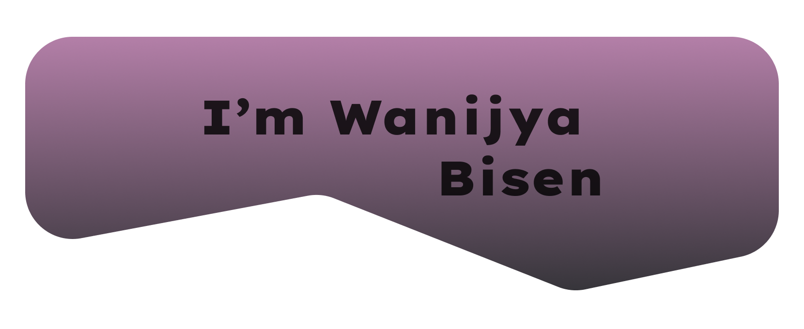

<h4 align="left">
  
  A versatile Software Engineer proficient in Python, JavaScript, Java, Express, MongoDB, React, Node.js, CSS, HTML, and MySQL. I specialize in full-stack development, crafting clean and efficient solutions. With a keen eye for detail and a commitment to best practices, I thrive in creating impactful software. Let's build something great! 🚀
</h4>

<h1 style="border-top: 1px solid #dadada"></h1>

## My Skills 🎯
<table align="center" cellpadding="10">
    <tr>
        <td align="center"> MongoDB</td>
        <td align="center"> Express</td>
        <td align="center"> React</td>
        <td align="center"> Next.js</td>
        <td align="center"> Node Js</td>
        <td align="center"> Three.js</td>
        <td align="center"> Material UI</td>
    <td align="center"> Tailwind CSS</td>
    <td align="center"> Bootstrap</td>
    <td align="center"> HTML5</td>
    <td align="center"> CSS3</td>
    </tr>
    <tr style="height: 20px;"></tr>
    <tr>
    <td align="center"> JavaScript</td>
    <td align="center"> TypeScript</td>
    <td align="center"> Java</td>
    <td align="center"> Python</td>
    <td align="center"> Firebase</td>
    <td align="center"> GitHub</td>
    <td align="center"> Vite</td>
    <td align="center"> VS Code</td>
    <td align="center"> Intellij</td>
    <td align="center"> PyCharm</td>
    <td align="center"> Figma</td>
    </tr>
</table>

<h1 style="border-top: 1px solid #dadada"></h1>

## Connect Me 🔗

    
  
  
  

